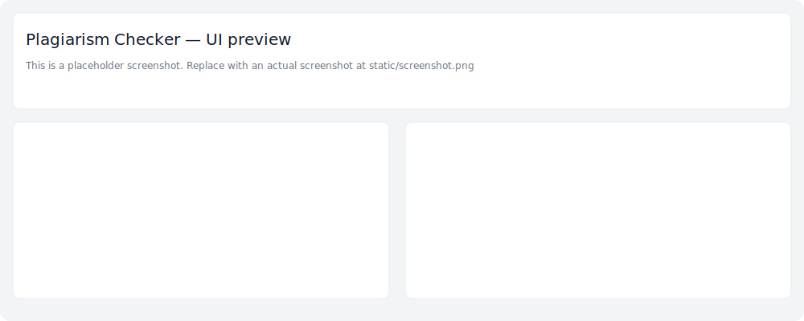

[](https://github.com/gregsanay/plagiarism_checker/actions/workflows/ci.yml)

# Plagiarism Checker + Paraphraser

A small, local-first web demo to compare a student draft against an article URL and produce simple paraphrases. The project is intentionally lightweight so users can run it locally and choose the ML engine they prefer (local PyTorch models, a remote inference API, or the built-in offline fallback).




## Why local-first

- **Privacy:** student drafts should not be sent to third-party services by default.
- **Flexibility:** the app works with any transformer model you provide (your own or from Hugging Face) or with the safe offline fallback included here.
- **Repo size:** large model binaries are excluded so the repository stays lightweight and easy to clone.

## Quick start (safe mode)

These steps run the app using the safe offline paraphraser (no heavy model downloads required):

```bash
python3 -m venv .venv
source .venv/bin/activate
pip install -r requirements.txt
.venv/bin/python app.py
```

Open http://127.0.0.1:5000/ in your browser.

## Enable transformer paraphraser (optional)

To use a real transformer paraphraser (higher quality), you must install `torch` and either allow the app to download models from Hugging Face or provide a local model cache. This may require hundreds of megabytes (or more) of downloads.

CPU-only torch (example):

```bash
pip install torch --index-url https://download.pytorch.org/whl/cpu
export ALLOW_MODEL_DOWNLOAD=true
```

Then restart the app. The app checks `ALLOW_MODEL_DOWNLOAD` and will set the Transformers pipeline to allow remote downloads when enabled.

## Model sizes (approximate)

- `torch` (CPU wheel): ~200–400 MB download, install footprint up to ~1 GB.
- `T5-small` paraphrase model: ~200–300 MB
- `T5-base` paraphrase model: ~700–900 MB
- `T5-large` paraphrase model: several GB

If you prefer not to download models automatically, see the Models section below for instructions to place models in the local cache.

## Releases & model bundles

This repository intentionally omits large model files. If you'd like to distribute model binaries to users, consider one of these approaches:

- Create a GitHub Release and attach the model bundle as a release asset (recommended for small numbers of artifacts).
- Host model files on a cloud storage bucket (S3, GCS) and link from a release or `models/README.md`.
- Use Git LFS to track large binaries. To enable LFS, run on your machine:

```bash
git lfs install
git lfs track "*.bin" "*.ckpt" "*.pth" "*.pt" "models/**"
git add .gitattributes
git commit -m "Track model binaries with Git LFS"
```

Then push as usual; GitHub will store LFS objects separately from the Git repository.

## Using your own model or engine

Options:

- Use a local model with `transformers` + `torch`: install dependencies, set `ALLOW_MODEL_DOWNLOAD=true` (or pre-populate the HF cache), and the app will load the pipeline.
- Use the Hugging Face Inference API or other hosted inference service (requires an API token and external network calls). Avoid this if you need full local privacy.
- Keep using the built-in offline paraphraser (safe by default) which performs deterministic, rule-based paraphrases and avoids large dependencies.

## Where to put model files

Transformers uses the Hugging Face cache by default (`~/.cache/huggingface/transformers` or the path in `$TRANSFORMERS_CACHE`). You can:

- Let `transformers` download the model automatically (set `ALLOW_MODEL_DOWNLOAD=true`).
- Or pre-download model files with `huggingface-cli` and place them into your cache or a local folder; set `TRANSFORMERS_CACHE` to that folder before running the app.

## Developer notes & file layout

- `app.py` — Flask app and the core logic (fetching, compare, paraphrase fallbacks).
- `templates/index.html` — UI markup (uses `static/style.css`).
- `static/style.css` — Minimal Academic theme for the demo.
- `requirements.txt` — Python packages used by the app (no heavy model artifacts included).

## How the paraphraser works (brief)

- If `transformers` + model are available and `get_paraphraser()` can instantiate the pipeline, the app will use the model to generate paraphrases.
- Otherwise the app falls back to a deterministic rule-based `offline_paraphrase()` which applies safe word substitutions and returns multiple variants. This keeps the demo usable without heavy dependencies.

## Examples

Paraphrase from Python REPL (local):

```python
from app import paraphrase_text
print('\n\n'.join(paraphrase_text('The quick brown fox jumps over the lazy dog.', num_return_sequences=3)))
```

Compare via the web UI: open the app and submit an article URL and a student draft, then click `Compare`.

## Privacy & limitations

- The app is a demo. Do not rely on it for formal academic integrity decisions without additional validation.
- If you enable remote inference or share model-hosting credentials, student data may leave your machine — document and obtain consent as required.

## Models & distribution

This repository omits large model binaries by design. If you want to distribute model artifacts alongside this repo:

- Use Git LFS for binary files, or provide a separate model bundle repository or release artifact.
- Include a `models/README.md` explaining which files to download and where to place them (we provide a template in this repo).

## Contributing

Contributions are welcome. Please open issues for bugs or feature requests. If you'd like to add support for additional paraphrase models, include an example and tests.

## Publishing & GitHub tips

- When publishing the repo, do not commit your `.venv` or any model caches. Use `.gitignore` (this repo includes a recommended `.gitignore`).
- If you want to provide model artifacts to users, use a release, an external host, or Git LFS.

## License

This project is provided under the MIT License. See `LICENSE`.

## Further help

If you want, I can:

- add a CI workflow to run unit tests and lint checks,
- prepare a `CONTRIBUTING.md` with developer setup steps,
- add a small example to show how to download and cache a model locally.

# Plagiarism Checker + Paraphraser

Minimal demo app to compare student text with an article URL and produce simple paraphrases.

## Quick start

1. Create and activate a Python virtual environment (recommended):

```bash
python3 -m venv .venv
source .venv/bin/activate
pip install -r requirements.txt
```

2. Run the app:

```bash
.venv/bin/python app.py
```

Open http://127.0.0.1:5000/ in your browser.

## About models and large files

- This repository intentionally excludes heavy model binaries (hundreds of MB to multiple GB). If you clone this repo, the app runs in "safe" offline mode using a lightweight fallback paraphraser.
- To enable the real transformer paraphraser locally, install `torch` and allow model downloads by setting:

```bash
export ALLOW_MODEL_DOWNLOAD=true
pip install torch
```

Model download sizes vary: CPU torch ~200–400MB; paraphrase model depends on variant (T5-small ≈200–300MB, T5-base ≈700–900MB, T5-large several GB).

## Styling

The app uses a simple Minimal Academic theme in `static/style.css`. Edit that file to adjust colors, spacing, and typography.

## License & Notes

This is a demo; use responsibly. If you want me to add CI, a GitHub Actions workflow, or instructions to bundle model artifacts separately, say which option you prefer.
